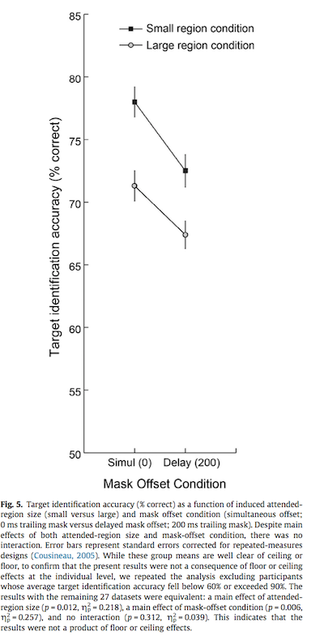

#### Article ID: set_ILpNO
#### Pilot: Sara Altman
#### Co-pilot: Tom Hardwicke  
#### Start date: Mar 11 2017
#### End date: Mar 17 2017
#### Final verification: Tom Hardwicke
#### Date: Nov 9 2017

-------

#### Methods summary: 
Experiment 1 examined the relationship between attended-region size and object-substituion masking. Inducer trials made up 80% of all trials. For each inducer trial, partipants responded to stimuli by determining if they were circles or ellipses. The stimuli were blocked such that they induced a small or large attended region. The remaining 20% of the trials were target trials. On half of the target trials, a four-dot mask disappeared simultaneously with the target (a circle). On the other half of the target trials, the four-dot mask disappeared 200 ms after the target disappeared. Participants were instructed to identify if the target circle had a spatial gap on its right or left side. Accuracy on all trials was recorded. 

The inducer stimuli consisted of small circles and ellipses (small inducer) and large circles and ellipses (large inducer). The masks were composed of four small dots arranged in a square. Small versus large inducer was blocked, such that each participant completed all small inducer trials and then all large inducer trials, or vice versa. The inducer trials and target trials were randomly interspersed.

Each testing session also began with a practice session of 20 trials.

------

#### Target outcomes:
A two-by-two repeated-measures ANOVA was conducted to analyze the influence of attended-region-size (large vs. small) and mask-offset condition (simultaneous vs. delayed) on target identification accuracy. The original experimenters reported a significant main effect of attended region size ($F(1, 38) = 15.36, p < 0.001, \eta^2_p = 0.241$) and a significant main effect of mask-offset condition ($F(1, 38) = 15.36, p < 0.001, \eta^2_p = 0.288$). They found no significant interaction between attended-region-size and mask-offset condition ($F(1,38) = 0.48, p = .494, \eta^2_p = 0.012$). 

------

```{r global_options, include=FALSE}
knitr::opts_chunk$set(echo=TRUE, warning=FALSE, message=FALSE)

# prepare an empty report object, we will update this each time we run compareValues2()
reportObject <- data.frame("Article_ID" = NA, "valuesChecked" = 0, "eyeballs" = 0, "Total_df" = 0, "Total_p" = 0, "Total_mean" = 0, "Total_sd" = 0, "Total_se" = 0, "Total_ci" = 0, "Total_bf" = 0, "Total_t" = 0, "Total_F" = 0, "Total_es" = 0, "Total_median" = 0, "Total_irr" = 0, "Total_r" = 0, "Total_z" = 0, "Total_coeff" = 0, "Total_n" = 0, "Total_x2" = 0, "Total_other" = 0, "Insufficient_Information_Errors" = 0, "Decision_Errors" = 0, "Major_Numerical_Errors" = 0, "Minor_Numerical_Errors" = 0, "Major_df" = 0, "Major_p" = 0, "Major_mean" = 0, "Major_sd" = 0, "Major_se" = 0, "Major_ci" = 0, "Major_bf" = 0, "Major_t" = 0, "Major_F" = 0, "Major_es" = 0, "Major_median" = 0, "Major_irr" = 0, "Major_r" = 0, "Major_z" = 0, "Major_coeff" = 0, "Major_n" = 0, "Major_x2" = 0, "Major_other" = 0, "affectsConclusion" = NA, "error_typo" = 0, "error_specification" = 0, "error_analysis" = 0, "error_data" = 0, "error_unidentified" = 0, "Author_Assistance" = NA, "resolved_typo" = 0, "resolved_specification" = 0, "resolved_analysis" = 0, "resolved_data" = 0, "correctionSuggested" = NA, "correctionPublished" = NA)
```

## Step 1: Load packages

```{r}
library(tidyverse) # for data munging
library(knitr) # for kable table formating
library(haven) # import and export 'SPSS', 'Stata' and 'SAS' Files
library(readxl) # import excel files
library(CODreports) # custom report functions
library(forcats) # tools for working with categorical variables
library(ez) # for anova
library(stringr) # tools for working with strings
```

## Step 2: Load data

```{r}
data <- read_excel("data/data.xlsx", skip = 2, col_names = FALSE)
```

## Step 3: Tidy data

The following code tidies the data such that there is one observation per row. 

```{r}
data_tidy <-
  data %>% 
  select(n = X__1,
         inducer_small = X__2,
         simul_small = X__3,
         delay_small = X__4,
         inducer_large = X__6,
         simul_large = X__7,
         delay_large = X__8) %>% 
  filter(n != "NA") %>% 
  gather(key = "measure", value = "value", 2:7, convert = TRUE) %>% 
  separate(measure, into = c("measure", "region_size"), sep = "_") %>% 
  mutate(value = as.double(value))
```

## Step 4: Run analysis

### Pre-processing

The original researchers stated that they excluded one participant because they performed below chance (50%) on the task. 

```{r}
# identify participants who were below chance
to_exclude <-
  data_tidy %>% 
  filter(measure == "inducer", 
         value < .5) %>% 
  .$n

# exclude participants who were below chance
data_tidy <-
  data_tidy %>% 
  filter(!(n %in% to_exclude))
```

They also stated that they re-ran their analysis after excluding any participant whose average accuracy was either below 60% or above 90%, in order to check for floor and ceiling effects at the individual level.

The following code creates a separate data frame that excludes such participants. 

```{r}
# identify ps
floor_ceil_exclude <- 
  data_tidy %>% 
  filter(measure != "inducer") %>% 
  group_by(n) %>% 
  summarise(average = mean(value, na.rm = TRUE)) %>% 
  filter(average > .9 | average < .6) %>% 
  .$n

# exclude ps
data_tidy_fc <-
  data_tidy %>% 
  filter(!(n %in% floor_ceil_exclude))
```

### Descriptive statistics

The original paper reported the mean inducer identification accuracy for both small and large inducers:

> For the remaining 39 participants, inducer identification accuracy was high (96% for the small inducers and 97% for the large inducers).

The following code reproduces this analysis:

```{r}
accuracy <-
  data_tidy %>%
  filter(measure == "inducer") %>% 
  group_by(region_size) %>% 
  summarise(accuracy = mean(value, na.rm = TRUE)) %>% 
  .$accuracy
```

```{r}
reportObject <- compareValues2(reportedValue = "97", obtainedValue = accuracy[1]*100, valueType = 'mean')
reportObject <- compareValues2(reportedValue = "96", obtainedValue = accuracy[2]*100, valueType = 'mean')
```
I found that mean inducer identification accuracy was `r accuracy[1]` for large inducers and `r accuracy[2]` for small inducers, confirming their calculations.

The original paper included a plot of target identification accuracy by condition: 



The error bars were corrected for repeated-meaures designs by using the strategy outlined in [Cousineau (2005)](http://www.tqmp.org/RegularArticles/vol01-1/p042/p042.pdf).

This chunk recreates the above plot:

```{r}
#group data by measure and region for plotting
grouped_data <-
  data_tidy %>% 
  filter(measure != "inducer") %>% 
  mutate(measure = fct_rev(measure)) %>% 
  group_by(region_size, measure) %>% 
  summarise(accuracy = mean(value, na.rm = TRUE)) %>% 
  ungroup() 

#average by subject to make the corrections for the error bars, as done in the original plot
avg_by_subject <-
  data_tidy %>% 
  filter(measure != "inducer") %>% 
  group_by(n) %>% 
  summarise(avg = mean(value, na.rm = TRUE))

#grand average for corrections
grand_avg <- mean(avg_by_subject$avg, na.rm = TRUE)

#create tibble for error bars
for_error_bars <-
  data_tidy %>% 
  filter(measure != "inducer") %>% 
  left_join(avg_by_subject, by = "n") %>% 
  mutate(value = value - avg + grand_avg) %>% 
  group_by(measure, region_size) %>% 
  summarise(se = sd(value) / sqrt(n())) %>% 
  left_join(grouped_data, by = c("region_size", "measure")) %>% 
  mutate(y_min = accuracy - ((1.96 * se)/2), y_max = accuracy + ((1.96 * se)/2))

#construct plot
grouped_data %>% 
  ggplot(aes(measure, accuracy)) +
  geom_line(aes(linetype = region_size, group = region_size)) +
  geom_point(aes(shape = region_size)) +
  geom_linerange(aes(ymin = y_min, ymax = y_max), size = .5, data = for_error_bars) +
  labs(y = "Target identification accuracy (% correct)",
       x = "Mask Offset Condition") +
  scale_x_discrete(labels = c("Simul (0)", "Delay (200)")) +
  scale_y_continuous(breaks = seq(.5, .85, by = .05), labels = function(x) {return(x*100)}) +
  coord_cartesian(ylim = c(.5, .85)) +
  theme_classic() +
  theme(aspect.ratio = 2)
```

The plots appear identical. 

```{r}
m <- grouped_data %>% filter(region_size == 'large', measure == 'simul') %>% pull(accuracy)
se <- for_error_bars %>% filter(region_size == 'large', measure == 'simul') %>% pull(se)
reportObject <- compareValues2(reportedValue = "eyeballMATCH", obtainedValue = m, valueType = 'mean')
reportObject <- compareValues2(reportedValue = "eyeballMATCH", obtainedValue = se, valueType = 'se')

m <- grouped_data %>% filter(region_size == 'large', measure == 'delay') %>% pull(accuracy)
se <- for_error_bars %>% filter(region_size == 'large', measure == 'delay') %>% pull(se)
reportObject <- compareValues2(reportedValue = "eyeballMATCH", obtainedValue = m, valueType = 'mean')
reportObject <- compareValues2(reportedValue = "eyeballMATCH", obtainedValue = se, valueType = 'se')

m <- grouped_data %>% filter(region_size == 'small', measure == 'simul') %>% pull(accuracy)
se <- for_error_bars %>% filter(region_size == 'small', measure == 'simul') %>% pull(se)
reportObject <- compareValues2(reportedValue = "eyeballMATCH", obtainedValue = m, valueType = 'mean')
reportObject <- compareValues2(reportedValue = "eyeballMATCH", obtainedValue = se, valueType = 'se')

m <- grouped_data %>% filter(region_size == 'small', measure == 'delay') %>% pull(accuracy)
se <- for_error_bars %>% filter(region_size == 'small', measure == 'delay') %>% pull(se)
reportObject <- compareValues2(reportedValue = "eyeballMATCH", obtainedValue = m, valueType = 'mean')
reportObject <- compareValues2(reportedValue = "eyeballMATCH", obtainedValue = se, valueType = 'se')
```

### Inferential statistics

The original authors conducted a two-way repeated measures ANOVA:

> Target identification accuracy data for the remaining 39 participants were submitted to a 2 (attended-region-size: small versus large) 2 (mask offset condition: simultaneous versus delayed) repeated-measures ANOVA. 

The following chunk runs this 2-by-2 repeated-measures ANOVA:

```{r}
for_anova <-
  data_tidy %>% 
  filter(measure != "inducer") %>%
  mutate(n = factor(n),
         measure = factor(measure),
         region_size = factor(region_size))

aov <- ezANOVA(data = for_anova, dv = value, wid = n, 
               within = .(measure, region_size), detailed = TRUE) 
```

The following is the report of the original findings:

> This revealed a significant main effect of attended-region size, F(1, 38) = 12.10, p = 0.001, g2p = 0.241, such that accuracy was higher in the small size versus large condition. This demonstrates that the manipulation of attended-region size was successful. There was a significant main effect of mask-offset condition, F(1, 38) = 15.36, p < 0.001, g2p = 0.288, whereby target identification was greater on the simultaneous than on the delayed mask-offset trials. This demonstrates the presence of OSM. How- ever, there was no reliable interaction between attended- region-size and mask-offset condition, F(1,38)=0.48, p=0.494, g2p = 0.012. This tells us that the effect of mask offset condition on target identification was unchanged by attended-region size.

This chunk reproduces these summary statistics for the two-by-two anova conducted above:

```{r}
#unlists the anova object so that values can be retrieved
unlisted <- unlist(aov)
aov
#creates a tibble (data frame) for the anova stats we care about
aov_stats <- 
  tibble(
    effect = c("condition", "region_size", "measure:region_size"),
    F = c(as.double(unlisted["ANOVA.F2"]), as.double(unlisted["ANOVA.F3"]), as.double(unlisted["ANOVA.F4"])), 
    p = c(as.double(unlisted["ANOVA.p2"]), as.double(unlisted["ANOVA.p3"]), as.double(unlisted["ANOVA.p4"])),
    SSn = c(as.double(unlisted["ANOVA.SSn2"]), as.double(unlisted["ANOVA.SSn3"]), as.double(unlisted["ANOVA.SSn4"])),
    SSd = c(as.double(unlisted["ANOVA.SSd2"]), as.double(unlisted["ANOVA.SSd3"]), as.double(unlisted["ANOVA.SSd4"]))
  ) %>% 
  mutate(partial_eta_squared = SSn / (SSn + SSd)) %>% 
  select(-SSn, -SSd) 

knitr::kable(aov_stats)
```

Run explicit comparisons:

> main effect of attended-region size, F(1, 38) = 12.10, p = 0.001, g2p = 0.241, 

```{r}
F1 <- aov_stats %>% filter(effect == 'region_size') %>% pull('F')
p <- aov_stats %>% filter(effect == 'region_size') %>% pull('p')
pes <- aov_stats %>% filter(effect == 'region_size') %>% pull('partial_eta_squared')

reportObject <- compareValues2(reportedValue = "1", obtainedValue = 1, valueType = 'df')
reportObject <- compareValues2(reportedValue = "38", obtainedValue = 38, valueType = 'df')
reportObject <- compareValues2(reportedValue = "12.10", obtainedValue = F1, valueType = 'F')
reportObject <- compareValues2(reportedValue = "0.001", obtainedValue = p, valueType = 'p')
reportObject <- compareValues2(reportedValue = "0.241", obtainedValue = pes, valueType = 'es')
```

> main effect of mask-offset condition, F(1, 38) = 15.36, p < 0.001, g2p = 0.288

```{r}
F1 <- aov_stats %>% filter(effect == 'condition') %>% pull('F')
p <- aov_stats %>% filter(effect == 'condition') %>% pull('p')
pes <- aov_stats %>% filter(effect == 'condition') %>% pull('partial_eta_squared')

reportObject <- compareValues2(reportedValue = "1", obtainedValue = 1, valueType = 'df')
reportObject <- compareValues2(reportedValue = "38", obtainedValue = 38, valueType = 'df')
reportObject <- compareValues2(reportedValue = "15.36", obtainedValue = F1, valueType = 'F')
reportObject <- compareValues2(reportedValue = "eyeballMATCH", obtainedValue = p, valueType = 'p')
reportObject <- compareValues2(reportedValue = "0.288", obtainedValue = pes, valueType = 'es')
```
> o reliable interaction between attended- region-size and mask-offset condition, F(1,38)=0.48, p=0.494, g2p = 0.012.

```{r}
F1 <- aov_stats %>% filter(effect == 'measure:region_size') %>% pull('F')
p <- aov_stats %>% filter(effect == 'measure:region_size') %>% pull('p')
pes <- aov_stats %>% filter(effect == 'measure:region_size') %>% pull('partial_eta_squared')

reportObject <- compareValues2(reportedValue = "1", obtainedValue = 1, valueType = 'df')
reportObject <- compareValues2(reportedValue = "38", obtainedValue = 38, valueType = 'df')
reportObject <- compareValues2(reportedValue = "0.48", obtainedValue = F1, valueType = 'F')
reportObject <- compareValues2(reportedValue = "0.494", obtainedValue = p, valueType = 'p')
reportObject <- compareValues2(reportedValue = "0.012", obtainedValue = pes, valueType = 'es')
```

The authors also ran another two-by-two repeated-measures ANOVA after excluding all participants whose average accuracy was either below 60% or above 90%, as stated in the pre-processing section. The original text is as follows:

> While these group means are well clear of ceiling or floor, to confirm that the present results were not a consequence of floor or ceiling effects at the individual level, we repeated the analysis excluding participants whose average target identification accuracy fell below 60% or exceeded 90%. The results with the remaining 27 datasets were equivalent: a main effect of attended- region size (p = 0.012, g2p = 0.218), a main effect of mask-offset condition (p = 0.006, g2p = 0.257), and no interaction (p = 0.312, g2p = 0.039). This indicates that the results were not a product of floor or ceiling effects.

This chunk reproduces that analysis:

```{r}
for_anova_fc <-
  data_tidy_fc %>% 
  filter(measure != "inducer")

aov_fc <- ezANOVA(data = for_anova_fc, dv = value, wid = n,
               within = .(measure, region_size), detailed = TRUE)

unlisted_fc <- unlist(aov_fc)

aov_stats_fc <- tibble(
  effect = c("condition", "region_size", "measure:region_size"),
  F = c(as.double(unlisted_fc["ANOVA.F2"]), as.double(unlisted_fc["ANOVA.F3"]), as.double(unlisted_fc["ANOVA.F4"])), 
  p = c(as.double(unlisted_fc["ANOVA.p2"]), as.double(unlisted_fc["ANOVA.p3"]), as.double(unlisted_fc["ANOVA.p4"])),
  SSn = c(as.double(unlisted_fc["ANOVA.SSn2"]), as.double(unlisted_fc["ANOVA.SSn3"]), as.double(unlisted_fc["ANOVA.SSn4"])),
  SSd = c(as.double(unlisted_fc["ANOVA.SSd2"]), as.double(unlisted_fc["ANOVA.SSd3"]), as.double(unlisted_fc["ANOVA.SSd4"]))
) %>% 
  mutate(partial_eta_squared = SSn / (SSn + SSd)) %>% 
  select(-SSn, -SSd)

knitr::kable(aov_stats_fc)
```

> a main effect of attended- region size (p = 0.012, g2p = 0.218), a main effect of mask-offset condition (p = 0.006, g2p = 0.257), and no interaction (p = 0.312, g2p = 0.039).

```{r}
p <- aov_stats_fc %>% filter(effect == 'region_size') %>% pull('p')
pes <- aov_stats_fc %>% filter(effect == 'region_size') %>% pull('partial_eta_squared')

reportObject <- compareValues2(reportedValue = "0.012", obtainedValue = p, valueType = 'p')
reportObject <- compareValues2(reportedValue = "0.218", obtainedValue = pes, valueType = 'es')

p <- aov_stats_fc %>% filter(effect == 'condition') %>% pull('p')
pes <- aov_stats_fc %>% filter(effect == 'condition') %>% pull('partial_eta_squared')

reportObject <- compareValues2(reportedValue = "0.006", obtainedValue = p, valueType = 'p')
reportObject <- compareValues2(reportedValue = "0.257", obtainedValue = pes, valueType = 'es')

p <- aov_stats_fc %>% filter(effect == 'measure:region_size') %>% pull('p')
pes <- aov_stats_fc %>% filter(effect == 'measure:region_size') %>% pull('partial_eta_squared')

reportObject <- compareValues2(reportedValue = "0.312", obtainedValue = p, valueType = 'p')
reportObject <- compareValues2(reportedValue = "0.039", obtainedValue = pes, valueType = 'es')
```

## Step 5: Conclusion

The reproduction was a success. I was able to reproduce the reported analyses and did not find any errors in the original paper.

```{r}
reportObject$Article_ID <- "ILpNO"
reportObject$affectsConclusion <- NA
reportObject$error_typo <- 0
reportObject$error_specification <- 0
reportObject$error_analysis <- 0
reportObject$error_data <- 0
reportObject$error_unidentified <- 0
reportObject$Author_Assistance <- F
reportObject$resolved_typo <- 0
reportObject$resolved_specification <- 0
reportObject$resolved_analysis <- 0
reportObject$resolved_data <- 0
reportObject$correctionSuggested <- NA
reportObject$correctionPublished <- NA

# decide on final outcome
if(reportObject$Decision_Errors > 0 | reportObject$Major_Numerical_Errors > 0 | reportObject$Insufficient_Information_Errors > 0){
  reportObject$finalOutcome <- "Failure"
  if(reportObject$Author_Assistance == T){
    reportObject$finalOutcome <- "Failure despite author assistance"
  }
}else{
  reportObject$finalOutcome <- "Success"
  if(reportObject$Author_Assistance == T){
    reportObject$finalOutcome <- "Success with author assistance"
  }
}

# save the report object
filename <- paste0("reportObject_", reportObject$Article_ID,".csv")
write_csv(reportObject, filename)
```

## Report Object

```{r, echo = FALSE}
# display report object in chunks
kable(reportObject[2:10], align = 'l')
kable(reportObject[11:20], align = 'l')
kable(reportObject[21:25], align = 'l')
kable(reportObject[26:30], align = 'l')
kable(reportObject[31:35], align = 'l')
kable(reportObject[36:40], align = 'l')
kable(reportObject[41:45], align = 'l')
kable(reportObject[46:51], align = 'l')
kable(reportObject[52:57], align = 'l')
```

## Session information

```{r session_info, include=TRUE, echo=TRUE, results='markup'}
devtools::session_info()
```